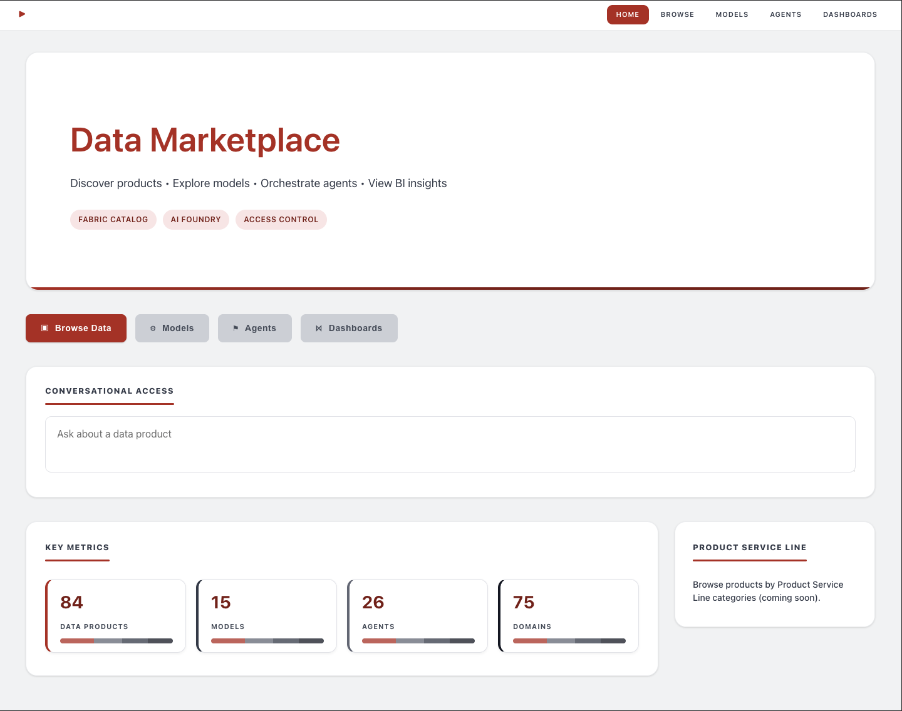
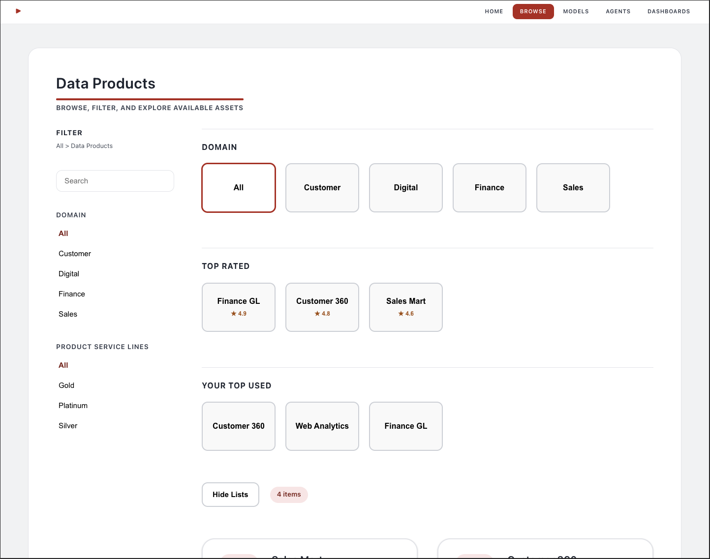
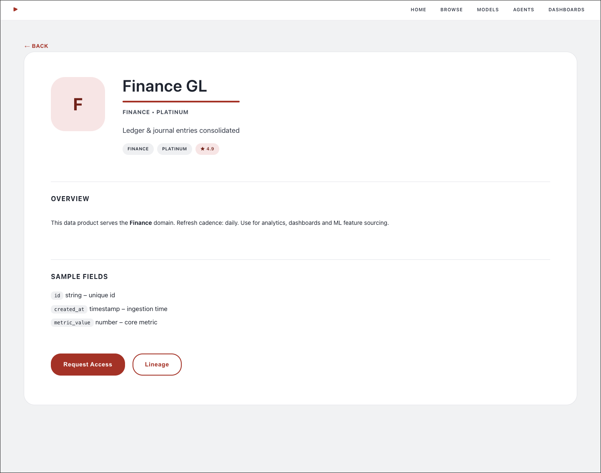

# Data Marketplace Starter (Angular)

An opinionated starter template for building an internal Data Marketplace / Data Product Portal. Provides a clean foundation for discovering data products, viewing product detail, curated product groupings, and future hooks for AI interaction & access workflows.

## Screenshots
| Home | Browse | Product Detail |
|------|--------|----------------|
|  |  |  |

<details>
<summary>Individual Images</summary>

**Home (Hero + KPIs)**  


**Browse Page**  


**Product Detail**  


</details>

## Core Features (Implemented)
* Product Browse: simplified, readable layout with sidebar filters (domain / PSL placeholder) and curated sections (Top Rated, Your Top Used – mock data).
* Product Detail: concise single‑column view with hero block and key metadata stubs.
* Unified Shell: consistent max-width layout, responsive spacing, right‑aligned navigation.
* Theming & Typography: scalable tokens, accessible contrast, simplified color system.
* Placeholder Services: in‑memory `DataProductService`, skeletal `AiChatService`, `AccessRequestService` stubs for later integration.

## Planned / Roadmap
| Area | Next Enhancements |
|------|-------------------|
| Data Products | Real API integration, pagination, domain & PSL facets, sorting |
| Curation | Usage analytics, personalized recommendations, rating model |
| Access | Request workflow (status tracking, approvals, notifications) |
| AI | Conversational product search, semantic lineage Q&A |
| Observability | Metrics panel populated from backend (counts, freshness) |
| Theming | Dark mode + high‑contrast variant |
| Testing | Add unit specs for services & browse filtering logic |
| Tooling | CI workflow, lint config, commit hooks |

## Project Structure (Key Paths)
```
src/app/
	app.component.*        # Root shell & navigation
	routes.ts              # Standalone route definitions
	features/
		browse/              # Browse page components (simplified layout)
		product/             # Product detail
		chat/                # Future conversational UI placeholder
	services/
		data-product.service.ts
		ai-chat.service.ts
		access-request.service.ts
	shared/                # Shared styles / future utilities
```

## Scripts
| Command | Description |
|---------|-------------|
| `npm start` | Dev server (Angular CLI) |
| `npm run build` | Production build (browser output in `dist/`) |
| `npm test` | Unit tests (Karma + Jasmine) |
| `npm run preview` | Static serve built assets (http-server, dist/data-marketplace) |

## Prerequisites
* Node.js 20.19.0+ (see `.nvmrc`)
* npm 8+

If using nvm:
```
nvm use
npm ci
npm start
```

## Development Notes
* This template intentionally keeps styles lean—local component styles over global complexity.
* Signals & standalone components minimize module overhead (Angular 20).
* Accessibility: focus-visible outlines preserved; aria attributes ready for enhancement.
* Mock data lives in `mock-data-products.json`; replace with API calls in `DataProductService`.

### Azure Functions backend (Databricks + Fabric)
- Location: `azure-func-databricks/` (dotnet-isolated)
- Endpoints:
	- `GET /api/data-products`, `GET /api/data-products/{product}/tables`, `GET /api/table-sample`
	- Fabric REST: `POST /api/fabric/chat` (proxies to Fabric Agent chat URL)
	- Fabric SDK: `POST /api/fabric/chat-sdk` (uses Azure.AI.Projects + Persistent Agents)
- Local settings required for Fabric SDK:
	- `PROJECT_ENDPOINT`: Project endpoint, e.g. `https://<service>.ai.azure.com/api/projects/<project-id>`
	- `FABRIC_AGENT_ID`: Persistent Agent id (e.g., `asst_...`)
	- Auth: Entra ID via `DefaultAzureCredential` or set `FABRIC_TENANT_ID`, `FABRIC_CLIENT_ID`, `FABRIC_CLIENT_SECRET` for ClientSecretCredential
	- Optional REST path: `FABRIC_API_KEY`, `FABRIC_AGENT_CHAT_URL`, `FABRIC_API_VERSION`
	- Example version (per tenant): `FABRIC_API_VERSION=2025-09-09`

Run locally:
```
cd azure-func-databricks
func start
```

## Customization Tips
| Need | Where |
|------|-------|
| Add facets | Extend `data-product.service.ts` (new signal + computed filter) |
| Branding colors | Global CSS variables (root styles) |
| Add KPI data | Replace placeholders in `landing` component and wire to service |
| Conversational AI | Implement logic inside `AiChatService` + chat component UI |

## License / Usage
Internal starter; adapt freely within your organization. Remove or replace any proprietary references.

## Changelog Snapshot
* v0.1.0: Initial Angular 20 migration, unified layout, browse & detail simplification, theming tokens.

---
Questions or improvements you'd like implemented next? Open an issue or extend the roadmap section.

## Template / Style Externalization
All previously inline component templates & styles have been moved to separate files for clarity and easier collaborative editing:

| Component | Template | Styles |
|-----------|----------|--------|
| Landing | `landing.component.html` | `landing.component.css` |
| App Shell | `app.component.html` | `app.component.css` |
| Browse | `features/browse/data-product-browser.component.html` | `features/browse/data-product-browser.component.css` |
| Product Detail | `features/product/data-product-detail.component.html` | `features/product/data-product-detail.component.css` |
| Product List | `features/product/data-product-list.component.html` | (inlined previously; no styles yet) |
| Chat Panel | `features/chat/chat-panel.component.html` | `features/chat/chat-panel.component.css` |

Add new components following the same pattern: generate with Angular CLI (or manually) and prefer external templates for anything non-trivial (> ~15 lines).
